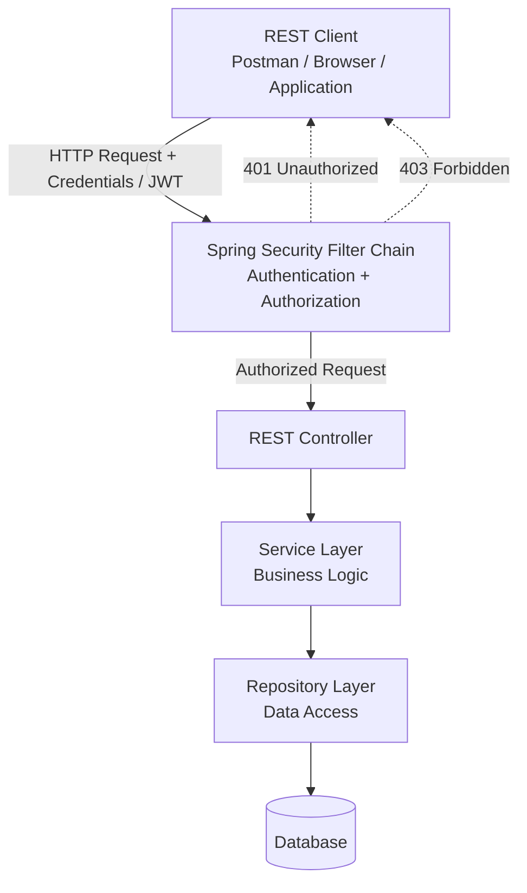

# Book Service — Spring Boot & Spring Security

A Spring Boot REST API demonstrating **secure API development using Spring Security**, authentication, authorization,
JWT-based security, and layered application architecture.

The project provides a practical reference for building a backend service where APIs are protected using authentication
and role-based authorization.

---

## 🎯 Problem Statement

Modern backend services cannot expose business APIs without considering authentication and authorization.

For example, a Book Management API may expose operations such as:

- View books
- Create books
- Update books
- Delete books

However, not every operation should be available to every user.

A typical requirement could be:

```text
                     Book Service

                    ┌─────────────┐
                    │    Client   │
                    └──────┬──────┘
                           │
                           ▼
                  ┌─────────────────┐
                  │ Authentication  │
                  │ & Authorization │
                  └────────┬────────┘
                           │
               ┌───────────┴───────────┐
               │                       │
               ▼                       ▼
          Read Operations         Write Operations
          USER / ADMIN               ADMIN
               │                       │
               └───────────┬───────────┘
                           ▼
                     Book Service
```

The problem this project addresses is:

> **How do we build a Spring Boot REST service where authentication and authorization are enforced consistently before
requests reach the business layer?**

The project demonstrates how Spring Security can be integrated into a REST API to establish a security boundary between
external clients and application functionality.

---

# 🏗️ High-Level Architecture

The application follows a layered architecture with Spring Security acting as the security boundary.



### Request Flow

```text
Client
  │
  │ HTTP Request
  │
  ▼
Spring Security Filter Chain
  │
  ├── Authentication
  │
  ├── Token Validation
  │
  ├── Authorization
  │
  ▼
Controller
  │
  ▼
Service
  │
  ▼
Repository
  │
  ▼
Database
```

The important architectural principle is:

> **Security is enforced before the request reaches the application business logic.**

---

# 🔐 Security Architecture

Spring Security provides the security boundary around the REST APIs.

```text
                         HTTP Request
                              │
                              ▼
                 ┌────────────────────────┐
                 │ Spring Security Filter │
                 │        Chain            │
                 └────────────┬───────────┘
                              │
                     ┌────────┴────────┐
                     │                 │
                     ▼                 ▼
                Authenticated?    Token Valid?
                     │                 │
                     └────────┬────────┘
                              ▼
                       Authorization
                              │
                    ┌─────────┴─────────┐
                    │                   │
                    ▼                   ▼
                 Allowed             Denied
                    │                   │
                    ▼                   ├──► 401
               Controller              │
                                       └──► 403
```

### Authentication

Authentication answers:

> **Who is the caller?**

### Authorization

Authorization answers:

> **What is the caller allowed to do?**

Keeping these concepts separate is fundamental to designing secure APIs.

---

# 🪪 JWT Authentication

When JWT authentication is enabled, the client sends a token with the request:

```http
Authorization: Bearer <JWT>
```

The request flow becomes:

```text
Client
  │
  │ Authorization: Bearer JWT
  ▼
Spring Security
  │
  ├── Extract JWT
  ├── Validate token
  ├── Validate signature
  ├── Extract user/roles
  └── Build SecurityContext
          │
          ▼
       Controller
```

The application can then use the authenticated identity and authorities when evaluating access to protected endpoints.

---

# 👥 Authentication vs Authorization

A secure API typically needs both.

### Authentication

```text
Who are you?
      │
      ▼
JWT / Credentials
      │
      ▼
Authenticated User
```

### Authorization

```text
What can you do?
      │
      ▼
Roles / Authorities
      │
      ▼
Endpoint Access
```

Example:

```text
USER
 ├── GET /books
 └── GET /books/{id}

ADMIN
 ├── GET    /books
 ├── POST   /books
 ├── PUT    /books/{id}
 └── DELETE /books/{id}
```

> Adjust the exact endpoint/role mapping above to match the current security configuration in the project.

---

# 🧩 Application Architecture

The project follows a conventional Spring Boot layered architecture:

```text
Controller
    │
    ▼
Service
    │
    ▼
Repository
    │
    ▼
Database
```

### Controller

Responsible for:

- HTTP endpoints
- Request mapping
- Request/response handling
- Validation boundaries

### Service

Responsible for:

- Business logic
- Transaction boundaries
- Domain operations

### Repository

Responsible for:

- Database access
- Persistence operations
- Query execution

### Security Layer

Cross-cuts the request path before the controller:

```text
Security
    │
    ▼
Controller
    │
    ▼
Service
    │
    ▼
Repository
```

---

# 🧰 Technology Stack

| Technology      | Purpose                        |
|-----------------|--------------------------------|
| Java            | Application development        |
| Spring Boot     | Backend framework              |
| Spring Web      | REST APIs                      |
| Spring Security | Authentication & authorization |
| JWT             | Stateless authentication       |
| Spring Data     | Persistence                    |
| Gradle / Maven  | Build automation               |
| JUnit           | Testing                        |

The repository is a Java-based Spring Boot project and is described on your GitHub profile as a book service with Spring
Security enabled.

---

# 📋 Prerequisites

Install:

- JDK 21+
- Git
- Gradle or Maven, depending on the project build configuration
- An IDE such as IntelliJ IDEA or VS Code
- Postman or another REST client

Verify Java:

```bash
java -version
```

---

# 🚀 Getting Started

## 1. Clone the repository

```bash
git clone https://github.com/ashutoshsahoo/book-service.git

cd book-service
```

---

## 2. Build the application

```bash
mvn clean package
```

---

## 3. Start the application

### Gradle

```bash
mvn spring-boot:run
```

The application will start using the configured Spring Boot server port.

---

# 🧪 API Testing

Use Postman, curl, or another REST client to interact with the API.

A typical API workflow is:

```text
1. Authenticate
       │
       ▼
2. Obtain JWT
       │
       ▼
3. Send JWT in Authorization header
       │
       ▼
4. Access protected Book APIs
```

Example:

```http
Authorization: Bearer <JWT>
```

---

# 📚 Book API

The service provides APIs for managing books.

Typical REST operations include:

| Operation | HTTP Method | Purpose        |
|-----------|-------------|----------------|
| Create    | `POST`      | Create a book  |
| Read      | `GET`       | Retrieve books |
| Update    | `PUT`       | Update a book  |
| Delete    | `DELETE`    | Delete a book  |

Example REST model:

```json
{
  "title": "Designing Data-Intensive Applications",
  "author": "Martin Kleppmann"
}
```

> The exact endpoint paths and request/response models should be kept synchronized with the controller implementation.

---

# 🔒 HTTP Security Responses

A secure API should clearly distinguish authentication and authorization failures.

### `401 Unauthorized`

The client has not successfully authenticated.

Examples:

```text
Missing token
Invalid token
Expired token
Invalid credentials
```

### `403 Forbidden`

The client is authenticated but does not have sufficient permissions.

Example:

```text
Authenticated USER
        │
        ▼
DELETE /books/10
        │
        ▼
403 Forbidden
```

This distinction is important when designing and troubleshooting secured REST APIs.

---

# 🛡️ Security Principles Demonstrated

This project demonstrates:

- Authentication
- Authorization
- JWT-based security
- Stateless API security
- Spring Security filter chain
- Security context
- Role/authority-based access control
- Protected REST endpoints
- HTTP `401` vs `403` handling

---

# 🧪 Testing Strategy

Security-focused testing should cover both successful and unsuccessful scenarios.

### Authentication Tests

```text
✓ Valid credentials
✓ Invalid credentials
✓ Missing credentials
✓ Invalid JWT
✓ Expired JWT
```

### Authorization Tests

```text
✓ Authorized USER access
✓ Authorized ADMIN access
✓ USER attempting ADMIN operation
✓ Unauthenticated access
```

### API Tests

```text
✓ Create book
✓ Retrieve book
✓ Update book
✓ Delete book
✓ Invalid book request
✓ Non-existent book
```

---

# 🔍 Troubleshooting

## Application starts but API returns 401

Check:

```text
Authorization: Bearer <JWT>
```

Also verify:

- JWT is valid
- JWT has not expired
- Authorization header is present
- Security configuration permits the endpoint

---

## API returns 403

The request is authenticated, but the authenticated principal does not have the required authority/role.

Check the role/authority contained in the authenticated security context.

---

## Application redirects to `/error`

For REST APIs, unexpected redirects to `/error` can often indicate an exception occurring during request processing or
security handling.

Check the application logs for the original exception before troubleshooting the `/error` endpoint itself.

---

# 📁 Project Structure

A typical structure for the service is:

```text
book-service/
│
├── src/
│   ├── main/
│   │   ├── java/
│   │   │   └── ...
│   │   │
│   │   └── resources/
│   │       ├── application.yml
│   │       └── ...
│   │
│   └── test/
│       └── ...
│
├── Dockerfile
├── pom.xml
└── README.md
```

---

# 🐳 Containerization

The application can be containerized using Docker.

Example:

```bash
docker build -t book-service:latest .
```

Run:

```bash
docker run \
  -p 8080:8080 \
  book-service:latest
```

For production deployments, consider:

- Non-root containers
- Multi-stage Docker builds
- Minimal JRE images
- Container vulnerability scanning
- Resource limits
- Health probes
- Externalized configuration
- Secret management

---

# ☸️ Kubernetes — Future Deployment

The service can be extended into a Kubernetes workload:

```text
                  Kubernetes Cluster
                         │
                  ┌──────▼──────┐
                  │   Service   │
                  └──────┬──────┘
                         │
              ┌──────────┴──────────┐
              ▼                     ▼
        Spring Boot Pod       Spring Boot Pod
              │                     │
              └──────────┬──────────┘
                         ▼
                     Database
```

Potential Kubernetes capabilities include:

- Deployment
- Service
- ConfigMap
- Secret
- Readiness probe
- Liveness probe
- Horizontal Pod Autoscaler
- Resource requests and limits
- Ingress / Gateway API

---

# 📈 Production Hardening

For a production-grade Spring Security service, consider adding:

### Security

- OAuth 2.0 / OpenID Connect
- External Identity Provider
- Key rotation
- Refresh-token strategy
- Fine-grained authorities
- Method-level security
- CORS policy
- CSRF strategy appropriate for the API
- Rate limiting
- Audit logging

### Secrets

Do not store:

```text
JWT secret
Database password
API keys
Private keys
```

directly in source control.

Use:

- Kubernetes Secrets
- HashiCorp Vault
- Cloud secret managers
- External Secrets Operator

### Observability

Add:

- Spring Boot Actuator
- Micrometer
- Prometheus
- Grafana
- OpenTelemetry
- Distributed tracing
- Structured logging

---

# 🎯 Learning Outcomes

After working through this project, you should understand:

1. How a Spring Boot REST API is structured.
2. How Spring Security intercepts HTTP requests.
3. How authentication differs from authorization.
4. How JWT enables stateless authentication.
5. How roles/authorities control API access.
6. How `401` and `403` differ.
7. How security concerns can be separated from business logic.
8. How a secured Spring Boot service can be containerized and deployed.

---

# 🚀 Possible Enhancements

The service can be evolved toward a production-grade backend by adding:

```text
                    API Gateway
                         │
                         ▼
                  ┌─────────────┐
                  │ Book Service│
                  └──────┬──────┘
                         │
          ┌──────────────┼──────────────┐
          ▼              ▼              ▼
       Database      Redis Cache     Kafka
                                         │
                                         ▼
                                  Event Consumers
```

Potential extensions:

- OAuth2 Resource Server
- Keycloak / external Identity Provider
- Redis caching
- Kafka domain events
- Outbox pattern
- PostgreSQL
- OpenTelemetry
- Prometheus + Grafana
- Docker
- Kubernetes
- CI/CD
- Contract testing
- Testcontainers

---

# ⭐ Key Takeaway

This project demonstrates a fundamental backend engineering principle:

> **Security should be treated as an architectural boundary, not as logic implemented independently inside every
business operation.**

Spring Security provides that boundary, while the application layers remain focused on their respective
responsibilities:

```text
                 Security Boundary
                        │
                        ▼
              ┌─────────────────┐
              │   Controller    │
              └────────┬────────┘
                       ▼
              ┌─────────────────┐
              │     Service     │
              └────────┬────────┘
                       ▼
              ┌─────────────────┐
              │   Repository    │
              └────────┬────────┘
                       ▼
                    Database
```

This repository serves as a practical reference for building **secure Spring Boot REST APIs with authentication,
authorization and JWT-based security**.